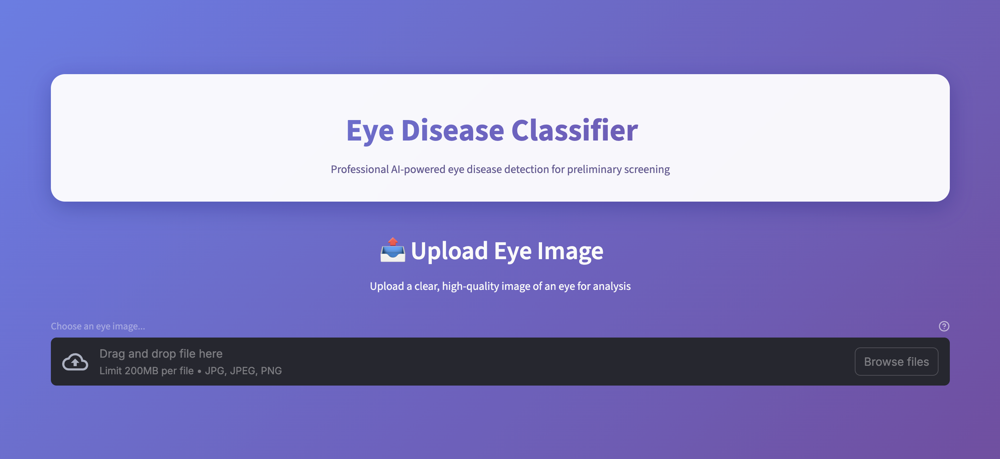
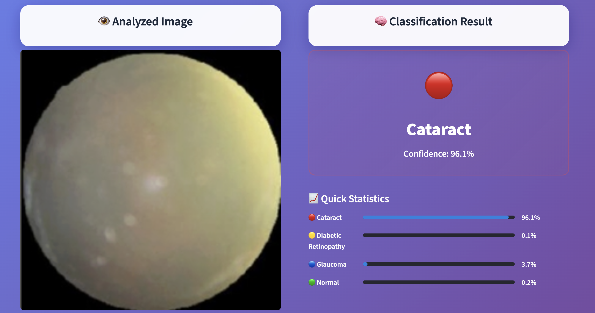

# 👀 Eye Disease Classifier

A **Streamlit web app** to classify **3 types of eye diseases** using an **EfficientNet-B3 model**. Users can upload an eye image and instantly get the predicted disease along with the confidence score.

---

## Dataset

The dataset consists of **retinal images** for the following classes:

- **Normal**  
- **Diabetic Retinopathy**  
- **Cataract**  
- **Glaucoma**

---

## Features

- **Upload & preview images** in real-time.  
- **Predict 4 eye diseases**: Normal, Diabetic Retinopathy, Cataract, Glaucoma.  
- **Confidence score display** for the prediction.  
- **Fast & efficient model loading** using Streamlit caching.  

---

## Demo

  
*Screenshot showing the upload box.*

  
*Screenshot showing the prediction result.*


---

## Installation

1. Clone the repository:

```bash
git clone https://github.com/yourusername/eye-disease-classifier.git
cd eye-disease-classifier
```

2. Install required packages:

```bash
pip install -r requirements.txt
```

3. Run the Streamlit app:

```bash
streamlit run app.py
```
